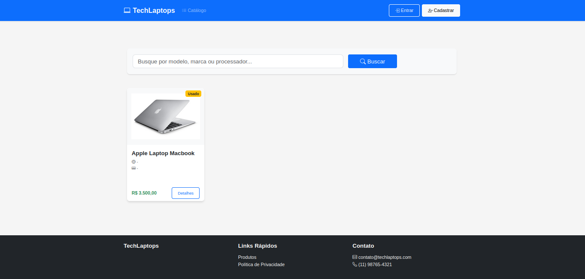

# Treinando com Django Framework

### migrando para banco PostgreSQL
`drive para django e postgres`
- pip install psycopg2
`para usar variaveis de ambient`
- pip install python-dotenv

#### Django_usage

ˋcomandos djangoˋ

- criado projeto
  python django-admin startproject core .
- rodar projeto
  python manage.py runserver
- criando app
  python manage.py startapp + nome
- criar as tabelas no banco
  python manage.py migrate
- fazendo mudancas e criar os arquivos de migracoes
  python manage.py makemigrations
- criando super usuario :
  python manage.py createsuperuser user>

#### instalar pacotes
  pip install -r + nome do pacote

  `Fluxo do Django Framework`

  

 `Imagem da aplicaçao/tela-principal`

  